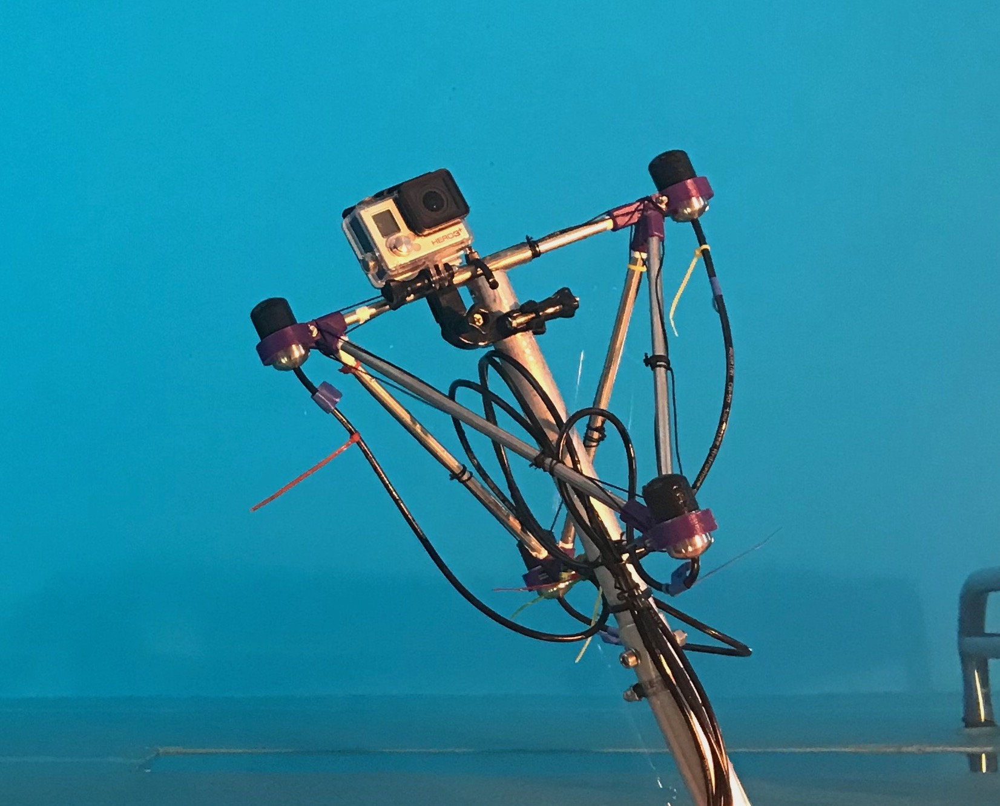

# Super-Hearing

This repository serves as a companion resource for the papers published in [1,2], which investigate technologies for bestowing "super-human-hearing-abilities" upon the user. More specifically, the term "super hearing", in this context, refers to the ability to simultaneously perceive and localise sound sources in situations where the listener would otherwise not be able to perceive and/or correctly localise them unaided.

The developed technologies rely on the use of sensor arrays to capture the surrounding sound-field. The array sensor signals are then analysed in order to extract spatial parameters over time and frequency, which are used to parametrically describe the sound scene; these include, e.g., the direction-of-arrival (DoA) of prominent sound sources, and indicators of the direct-to-diffuse ratio (DDR). Using this information, and through the use of suitable rendering techniques, signals exhibiting the correct spatial cues can then be reproduced over headphones worn by the user. This therefore allows the user to both perceive and localise sound sources in the scene.

## [Ultrasonic-Super-Hearing](Ultrasonic-Super-Hearing) 

For the project described in [1], ultrasonic sound sources, which are inaudible to humans, were captured using a 6-sensor ultrasonic microphone array. This microphone array was mounted to the headphones worn by the user, and the estimated DoAs are used to appropriately reproduce a pitch-shifted signal (down ~3octaves) over the headphone channels. Through this device, the user can not only perceive the captured ultrasonic sound sources (such as sound produced by bats or leaking pipes), but they can also localise these sources in the correct direction.


[**Video Demo**](https://www.youtube.com/watch?v=HMkZs7a1nQc)

* [1] Pulkki, V., McCormack, L. & Gonzalez, R. 2021. [**Superhuman spatial hearing technology for ultrasonic frequencies**](https://www.nature.com/articles/s41598-021-90829-9). Scientific Reports 11, 11608 (2021). https://doi.org/10.1038/s41598-021-90829-9

## [Underwater-Super-Hearing](Underwater-Super-Hearing) 

In [2], underwater sound sources, which are audible to humans but are typically localised very poorly, were captured by a 4-sensor hydrophone array. Since humans primarily evolved in the air domain, humans are generally much worse at localising sound sources in other mediums; such as underwater. However, by capturing underwater sound sources with a hydrophone array, and reproducing the sources in the analysed DoAs using head-related transfer functions (HRIRs) measured in air, it is possible for a listener to localise underwater sound sources much more easily.



[**Video Demo**](https://www.youtube.com/watch?v=3WARepl3lEg)

* [2] Delikaris-Manias, S., McCormack, L., Huhtakallio, I. and Pulkki, V. 2018, May. [**Real-time underwater spatial audio: a feasibility study**](Underwater-Super-Hearing/docs/delikaris2018real.pdf). In Audio Engineering Society Convention 144. Audio Engineering Society.

## Building the plugins

If you wish to build the plugins, then you must first clone the repository with:
```
git clone --recursive https://github.com/leomccormack/Super-Hearing
# or if you have already cloned the repository, update with
git submodule update --init --recursive
```

The [VST2_SDK](https://web.archive.org/web/20181016150224/https://download.steinberg.net/sdk_downloads/vstsdk3610_11_06_2018_build_37.zip) should then be placed in the 'externals' folder like so:
```
externals/VST2_SDK
```

**MacOSX, Linux and Windows (x86_64/amd64)** users must install a custom Intel MKL library. Detailed instructions on how to do this can be found [here](https://github.com/leomccormack/Spatial_Audio_Framework/blob/master/docs/PERFORMANCE_LIBRARY_INSTRUCTIONS.md). 

**Raspberry Pi (ARM)** users instead require OpenBLAS and LAPACKE libraries:
``` 
sudo apt-get install liblapack3 liblapack-dev libopenblas-base libopenblas-dev liblapacke-dev
```

**Linux (x86_64/amd64 and ARM)** users must also install the following libraries (the former line for JUCE, and the latter line for the Spatial_Audio_Framework):

```
sudo apt-get install x11proto-xinerama-dev libwebkit2gtk-4.0-dev libgtk-3-dev x11proto-xext-dev libcurl4-openssl-dev libasound2-dev
sudo apt-get install libhdf5-dev libnetcdf-dev libnetcdff-dev
```

The plug-in may be built with CMake (version 3.15 or higher) via:
 ```
 mkdir build
 cmake -S . -B build -DSAF_ENABLE_SOFA_READER_MODULE=1
 cd build
 make
 ```

Or for, e.g., Visual Studio users:
```
cmake -S . -B build -G "Visual Studio 15 Win64" -DSAF_ENABLE_SOFA_READER_MODULE=1 
cd build
msbuild ALL_BUILD.vcxproj /p:Configuration=Release /m
```

## License

Refer to the top of each source file for information regarding licenses. However, in general, most of the code is provided permissively under the terms of the [ISC License](https://choosealicense.com/licenses/isc/). Whereas, audio plugin related code, which is developed using JUCE, is instead provided under the copy-left [GNU GPLv3 License](https://choosealicense.com/licenses/gpl-3.0/).
