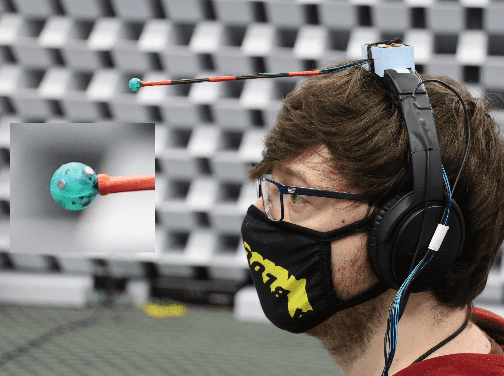
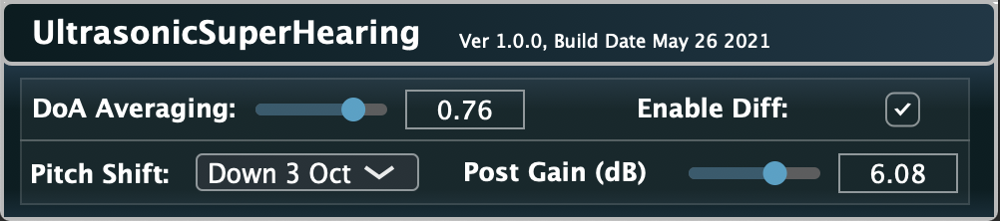

# Ultrasonic-Super-Hearing

Ultrasonic sound sources are inaudible to humans. While there do exist devices that can capture, pitch shift and reproduce ultrasonic sound sources for humans to listen to, they generally only employ a single microphone and loudspeaker. Therefore, the listener is unable to localise where these pitch shifted ultrasonic sound sources are located.

However, by instead capturing the ultrasonic sound sources using an array of microphones, it is possible to estimate their direction of arrival (DoA), and use this information to spatialise a pitch shifted signal in this direction. Therefore, not only would the listener be able to perceive these ultrasonic sound sources, but they may also be able to localise them in the correct direction.

## Building a suitable ultrasonic microphone array

The CAD files and drawings used for 3D printing the 6 sensor proof-of-concept array, which was employed for the study detailed in [1], can be found in the [**hardware**](hardware) folder. Further details regarding its construction can be found in the paper.

## Auralising the captured ultrasonic sound scene

A real-time audio plugin, the source code for which can be found in the [**audio_plugins**](audio_plugins) folder, was developed for rendering the 6 microphone signals to the 2 binaural channels. It employs the DoA estimation, pitch-shifting, and binauralisation, as described and used for the listening tests conducted in [1].
 

This processing is demonstrated in the following video:

(Please wear headphones)

## References

* [1] Pulkki, V., McCormack, L., and González, R. 2021. [**Superhuman spatial hearing technology for ultrasonic frequencies**](). Accepted at: Nature Scientific Reports.
