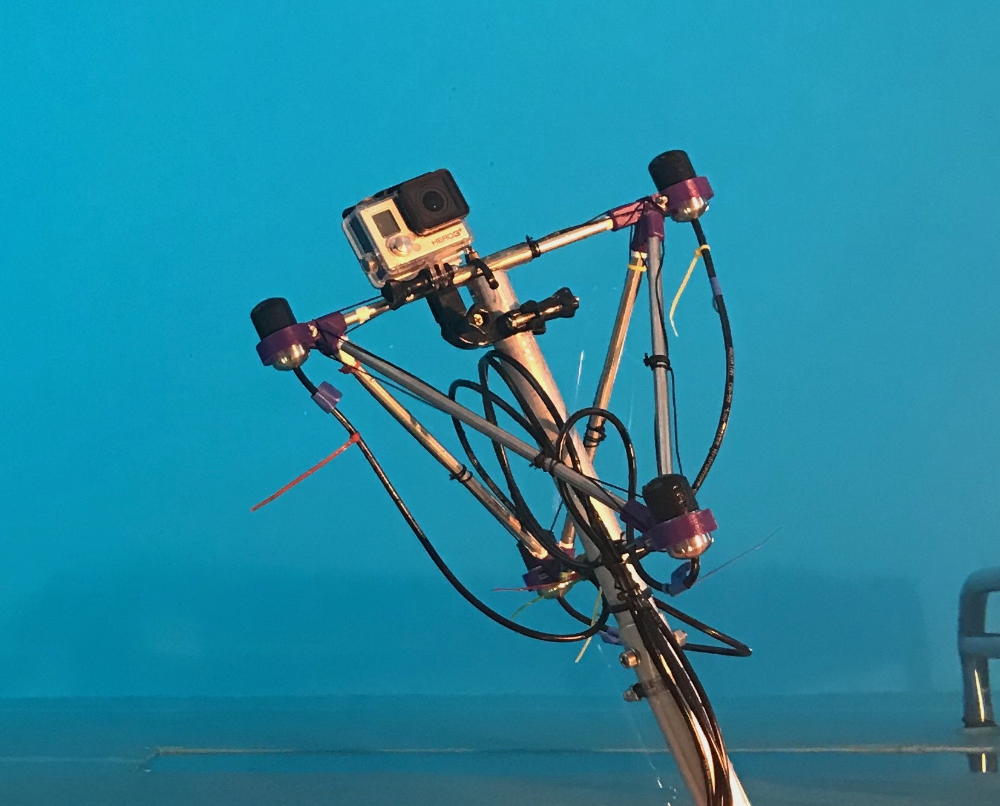

# Underwater-Super-Hearing

Have you ever noticed that when you put your head underwater in a swimming pool, it is incredibly difficult to localise sound sources? This is largely due to the fact that the speed of sound in water is significantly faster than in air. The interaural time differences are much shorter, and the manner in which sound waves physically interact with the geometry of your head and pinna is very different. Since humans have primarily evolved to interpret spatial hearing cues produced by sound sources in air, we are generally not very well accustomed to interpreting them when underwater.

However, if one were to record the underwater sound scene using a hydrophone array, determine the directions of underwater sound sources, and subsequently use this information to reproduce the signals based on head-related transfer functions (HRIRs) measured in air, then the appropriate spatial hearing cues can be delivered to the listener.

## Building a suitable hydrophone array

The CAD files and drawings used for 3D printing the hydrophone clamps and for building the tetrahedral hydrophone array, employed for the study detailed in [1], can be found in the [**hardware**](hardware) folder. Further details regarding its construction can be found in the paper.

Note that commercially available hydrophone sensors are usually physically larger than the sensors you would typically find in a 4 sensor A-format microphone array. However, since the speed of sound is around 4-5 times faster in water than in air, their effective size is similar, if not smaller. The radius of the hydrophone array built for [1] was also made larger than a comparable air domain microphone array for this same reason.

## Auralising the captured underwater sound scene

The parametric binaural renderer (hodirac_binaural VST plug-in) used for this study can be freely downloaded from [**here**](http://research.spa.aalto.fi/projects/sparta_vsts/), and is detailed further in [2]. It requires first converting the hydrophone signals into first-order Ambisonic (FOA) signals, using, for example, the sparta_array2SH VST plug-in. 

The decoder [2] then uses this FOA input to analyse the directions of sound sources in frequency bands, and subsequently use this information to reproduce the captured sound scene over headphones. If the employed HRIRs for the rendering stage are measured in the air domain, then the correct spatial cues will be delivered to the listener; thus, allowing them to localise the underwater sound sources. This processing is demonstrated in the following video:

(Please wear headphones)

## References

* [1] Delikaris-Manias, S., McCormack, L., Huhtakallio, I. and Pulkki, V. 2018, May. [**Real-time underwater spatial audio: a feasibility study**](docs/delikaris2018real.pdf). In Audio Engineering Society Convention 144. Audio Engineering Society.
* [2] Politis, A., McCormack, L. and Pulkki, V., 2017. [**Enhancement of ambisonic binaural reproduction using directional audio coding with optimal adaptive mixing**](http://research.spa.aalto.fi/projects/sparta_vsts/publications/politis2017enhancement.pdf). In 2017 IEEE Workshop on Applications of Signal Processing to Audio and Acoustics (WASPAA) (pp. 379-383). IEEE.

